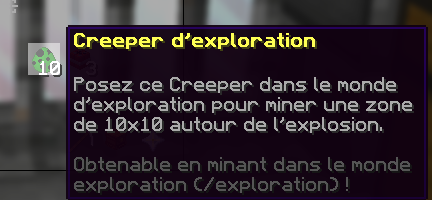
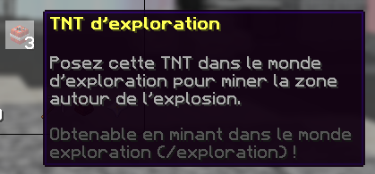
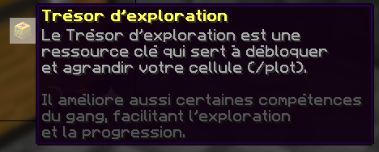

# 💰 Loot de l'exploration


Cette page a pour but de vous expliquer les loots disponibles en monde exploration


## **➺** Loot consommable

* **L'oeuf de creeper** : L'œuf de creeper génère une explosion semblable à celle de l'excavation. L'explosion génère une zone de 11 x 11 x 11. L'œuf de creeper se pose au sol, il est nécessaire d'avoir 2 blocks de hauteur au-dessus du block sur lequel vous faites spawn le creeper

*  **TNT** : La TNT créée une petite explosion dans une zone de 3 x 3. Elle agit tel un projectile, elle est projeté dans la direction que vous pointez au moment du clique droit

   

## **➺** Trésor

* Ils se trouvent dans le monde exploration. Les trésors permettent d'améliorer vos [cellules](COMPLETER).

* Les trésors ont une meilleure chance d'être trouvés à l'aide de l'enchantement [chercheur de trésor](mo/enchantements.md).

* Les trésors sont indispensables pour améliorer votre [sac de bloc](exploration_bag.md) et pour améliorer les compétences dans votre [gang](../gangs.md).

