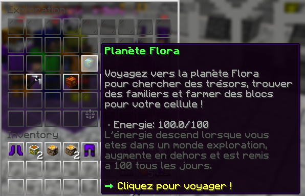

# 🌳 Planète Flora

  
  Cette page a pour but de vous expliquer le principe de la planète Flora et son utilité pour l'exploration.
  

  ## **➺** Comment accéder à la planète Flora ?

  
  L"exploration ne s'effectue qu'à partir du niveau 50.
  

  Pour accéder à la planète Flora, il vous suffit simplement d'effectuer la commande /explo, puis de cliquer sur la planète bleue.

La planète Flora vous permet d'accéder au monde de minage de l'exploration.
Au sein de cette planète, pour pourrais trouver des trésors, farmer des blocs pour construire dans votre cellule, et améliorer votre multitool.
