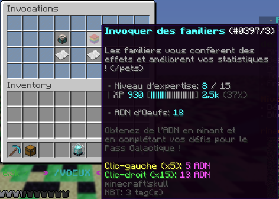
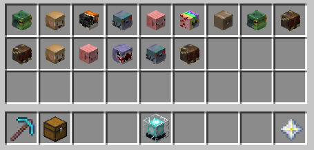
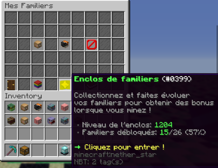
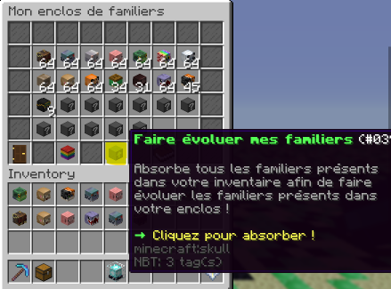
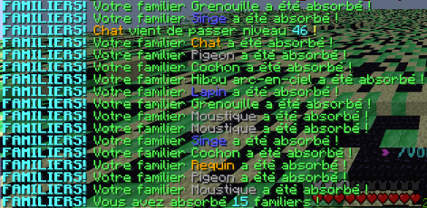

# 🐈​ Pets
> Cette page a pour but de vous expliquer comment obtenir des pets, comment procéder pour les améliorer et expliquer les différents pets disponibles.

## **➺** Comment obtenir des pets ?
Pour obtenir des pets, vous avez besoin d'obtenir premièrement des "ADN d'Oeuf", ils permettent d'invoquer de nouveaux pets à partir de la commande /voeux.  
Vous pouvez en invoquez 5 en cliquant dessus avec le clique gauche, et 15 avec le clique droit.

Vous pouvez obtenir ces derniers en minant, dans les coffres cosmiques, mais aussi dans le /afk et dans le /pass.
Une fois invoquez, les pets seront dans votre inventaire.  

**Pour les Rendres actifs, il faut les faires rentrer dans l'enclos (/pet) ↓**  

Et pour les rentrer, cliquez sur "Faire évoluer mes familiers"  

  
Une fois absorbé dans l'enclos, un message s'afficheras dans le tchat:  
  
  

## **➺** Comment améliorer des pets ?
Comme pour les objets, les robots possèdent, eux aussi, une rareté. En augmentant son niveau d'expertise dans le /voeux à force de créer de nouveaux robots, la rareté des robots obtenables augmente (la rareté fonctionne de manière similaire à celle du scanner).  
Pour améliorer le niveaux des pets, vous pouvez en faire xp en minant 1 à 3 (selon votre rang /rang) dans l'incubateur du menu /pet ou en mettant dans l'enclos un pet que vous avez déjà, cela lui fera gagner de l'xp.

## **➺** Quels sont les différences entre chaque pets ?

|  Nom  | Rareté       | Effet     |
|-------|--------------|-----------|
|Moustique| Normal       | Augmente votre bonus de tokens |
|Pigeon| Normal | Augmente votre bonus de RinaCoins|
|Souris| Normal | Augmente la chance de déclenchement de l'enchantement Veine Miner|
|Cochon| Commun |Augmente la quantité de fragments d'étoiles que vous recevez lorsque vous recyclez un équipement|
|Grenouille|Commun|Augmente la chance de déclenchement de l'enchantement Explosion|
|Hibou arc-en-ciel|Commun|Augmente les bonus de Tokens/Rinacoins des autres joueurs présents dans vore mine|
|Panda| Rare|Augmente la quantité de Beacons que vous pouvez trouver dans la Mine Pvp|
|Lapin| Rare| Offre une chance de monter de deux rangs au lieu d'un lors d'un rankup|
|Singe| Rare| Augmente le bonus de Token de vos Enchantements|
|Renard|Epique|Diminue le prix pour rankup|
|Tortue|Epique|Augmente vos bonus de Tokens/Rinacoins en foction de votre statistique de vitesse|
|Taupe| Epique|Augmente la chance de déclenchement de l'enchantement Excavation|
|Requin|Legendaire|Augmente vos bonus de Tokens/RinaCoins en fonction de votre maximum de Mana|
|Chat|Legendaire|Augmente votre vitesse de déplacement|
|Gorille|Legendaire|Augmente les bonus de Tokens/Rinacoins des autres joueurs présents dans vore mine|
|Abeille|Divin|Augmente le bonus de la surcharge d'énergie mais aussi l'énergie requis pour l'activer ! **A VENIR**|
|Pengouin|Divin|Augmente la quantité de fragments d'étoiles que vous recevez lorsque vous recyclez un équipement|
|Phoenix|Divin|Augmente la durée des prochains boosters que vous activez|
|Mamouth|Mythique|Augmente considérablement la taille de votre sac à dos|
|Ours|Mythique|Augmente les statistiques de tous vos robots|
|Wumpus|Cosmique|Augmente les bonus de Tokens/Rinacoins des autres joueurs présents dans vore mine|
|Axolotl|Cosmique|Augmente la quantité de noyaux d'étoiles que vous recevez lors d'une Ascension|
|Rocket|Primordial|Augmente votre chance d'obtenir des statistiques déjà améliorées sur les équipements que vous trouvez|
|Doge|Primordial|Augmente considérablement votre bonus de RinaCoins|
|Loup Enflammé|Transcendant|Augmente la chance de déclenchement de l'enchantement Nuke|
|Elephant cosmique|Transcendant|Augmente la quantité de fragments d'étoiles que vous receves lorsque vous recyclez un équipement|
