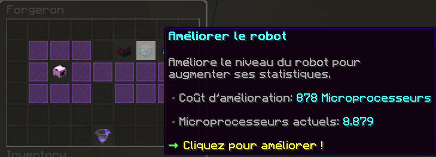

# 🤖 Robots


Cette page a pour but de vous expliquer comment obtenir des robots et aussi comment procéder pour les améliorer.


## **➺** Comment obtenir des robots ?

Pour obtenir des robots, vous avez besoin d'obtenir premièrement des schémas de robots. Ces schémas permettent de créer de nouveaux robots à partir de la commande /voeux.\
Vous pouvez les obtenir en minant, dans les coffres cosmiques, mais aussi dans le /afk et dans le /pass.

| Type de robot            | Bonus de Tokens                                        | Bonus de RinaCoins                                     | Bonus d'XP de pioche                                      |
| ------------------------ | ------------------------------------------------------ | ------------------------------------------------------ | --------------------------------------------------------- |
| Image leur correspondant |  |  |  |

## **➺** Comment améliorer les robots ?

Comme pour les objets, les robots possèdent, eux aussi, une rareté. En augmentant son niveau d'expertise dans le /voeux à force de créer de nouveaux robots, la rareté des robots obtenables augmente (la rareté fonctionne de manière similaire à celle du scanner).

Quand vous créez des robots, ils possèdent une étoile, vous pouvez améliorer les robots grâce aux **microprocesseurs**, qui s'obtiennent en recyclant des robots auprès du forgeron, ou via le **recyclage automatique**. Chaque robot peut êtrz amélioré jusqu'à 9 fois, pour un total de 10 étoiles.

Pour améliorer un robot, placez le dans la forge de la même manière que les gemmes et armures et sélectionner l'option "Améliorer le robot". Vous pouvez aussi **échanger le type d'un robot** *(exemple: passer d'un robot Rinacoins à un robot Tokens)* contre **25000 beacons** (attention le changement 
est aléatoire, il est donc conseillé de ne changer de rareté de robot que sur un robot de haute rareté au vu du prix couteux de l'opération).

Par exemple, sur l'image ci-dessus, il vous faut 878 microprocesseurs pour améliorer ce robot 1 étoile et lui conférer une deuxième étoile, qui lui octroiera un bonus d'XP de pioche plus conséquent.

## **➺** Quelles sont les différences entre les raretés ?

Les statistiques données sont celles des robots possédant une seule étoile :

| Rareté       | Boost (%) |
| ------------ | --------- |
| Normal       | +21%      |
| Commun       | +61%      |
| Rare         | +126%     |
| Épique       | +197%     |
| Légendaire   | +279%     |
| Divin        | +509%     |
| Mythique     | +561%     |
| Cosmique     | N/A       |
| Primordial   | N/A       |
| Transcendant | N/A       |
