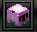
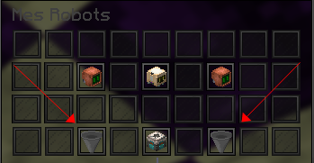

# 🤖 Robot
> Cette page a pour but de vous expliquer comment obtenir des robots et aussi comment procéder pour les améliorer.

## **➺** Comment obtenir des robots ?
Pour obtenir des robots, vous avez besoin d'obtenir premièrement des schémas de robots. Ces schémas permettent de créer de nouveaux robots à partir de la commande /voeux.  
Vous pouvez les obtenir en minant, dans les coffres cosmiques, mais aussi dans le /afk et dans le /pass.  

| Type de robot            | Bonus de Tokens                          | Bonus de RinaCoins                      | Bonus d'XP de pioche                     |
|--------------------------|------------------------------------------|-----------------------------------------|------------------------------------------|
| Image leur correspondant |  |  |  |

## **➺** Comment améliorer les robots ?
Comme pour les objets, les robots possèdent, eux aussi, une rareté. En augmentant son niveau d'expertise dans le /voeux à force de créer de nouveaux robots, la rareté des robots obtenables augmente (la rareté fonctionne de manière similaire à celle du scanner).  

Quand vous créez des robots, ils possèdent une étoile, vous pouvez améliorer les robots d'une même rareté et du meme nombre d'étoiles en les fusionnant avec le hopper/entonnoir présent dans le menu /robot. A partir du rang 100, l'amélioration éclair (premier hopper/entonnoir enchanté) permet de fusionner automatiquement vos robots.  

Par exemple, deux robots d'une rareté Rare, avec une étoile chacun vous donneront un robot Rare avec deux étoiles avec un petit boost de statistiques.

## **➺** Quelles sont les différences entre les raretés ?
Les statistiques données sont celles des robots possédant une seule étoile :

| Rareté       | Boost (%) |
|--------------|-----------|
| Normal       | +21%      |
| Commun       | +61%      |
| Rare         | +126%     |
| Épique       | +197%     |
| Légendaire   | +279%     |
| Divin        | +509%     |
| Mythique     | +561%     |
| Cosmique     | N/A       |
| Primordial   | N/A       |
| Transcendant | N/A       |
