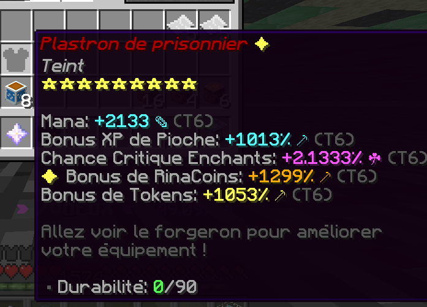

# 🔮 Objets


Cette page a pour but de vous expliquer comment obtenir des objets (Armures & Gemmes) mais aussi comment procéder pour les améliorer.


## **➺** Comment obtenir des objets ?

Pour obtenir des objets, il vous suffit de miner dans votre mine, vous obtenez un objet en moyenne tous les 100 blocs minés. Vous obtenez aléatoirement une des six gemmes existantes (Rubis, Topaz, Améthyste, Saphire, Émeraude, Opale) ou une pièce d'armure.

L'objet alors obtenu possédera une rareté, allant de Normal à Transcendant.


&#x20;Le scanner est l'outil définissant la rareté des objets que vous allez obtenir, pour en savoir plus, [cliquez ici](../tools/scanner.md).


### **➺** Objets étoilés 

Chaque objet a une chance de posséder **une ou plusieurs étoile(s)** lors de son obtention. Elles s'attachent à une statistique aléatoire de votre pioche (une étoile par statistique). Elles octroient un bonus de **50%** de statistiques à l'affixe sur lequel elles sont attachées. Les étoiles ne peuvent pas être ajoutées ou retirées.
**NOTE IMPORTANTE**: Le boost octroyé n'est pas global, mais équivalent à 50% de votre boost maximum de **tier**.
*Exemple: si le boost était global, sur une statistique de tier 6 à 1000%, l'étoile octroierait un boost de 500% (50% de 1000), soit 1500%*
*Avec le boost étoilé, le boost de 50% ne s'applique que sur l'augmentation du tier: si le passage de tier 5 (800%) à 6 vous a octroyé 200% en plus (soit 1000% dans cet exemple), l'étoile aportera 50% de ces 200% (soit 100%), pour un bonus total de 1100%.*

## **➺** Comment modifier les objets obtenus ?

Pour modifier des objets, il vous suffit de faire la commande **/forge** qui vous ouvrira un menu, une fois dans celui-ci, il vous suffit de cliquer sur l'objet que vous souhaitez modifier. Une fois cela fait, plusieurs options s'offrent à vous :

### Options de modification :

### 1. Supprimer l'objet

* **Description :** Comme son nom l'indique, cette option permet de supprimer un objet. Le forgeron vous l'échangera contre des fragments d'étoiles.

### 2. Recalculer une statistique _(Entre 2 et 5 de durabilité)_

* **Description :** Cette option permet de modifier le taux de bonus d'une statistique aléatoire. Le pourcentage donné d'une statistique se trouve dans un intervalle qui dépend de la rareté de l'objet.
* **Note :** Recalculer la statistique permet d'optimiser ce que l'objet peut apporter. Le choix de la statistique ainsi que sa modification sont faits de façon aléatoire.

### 3. Améliorer une statistique _(Entre 5 et 15 de durabilité)_

* **Description :** Cette option permet d'améliorer une statistique **au hasard** sur votre objet.
* **Note :** Le maximum d'amélioration sur une statistique est de 6 (Tier 6 ou T6).

### 4. Ajouter une statistique _(Entre 15 et 30 de durabilité)_

* **Description :** Cette option permet d'ajouter une statistique **au hasard** sur votre objet.

### 5. Remplacer une statistique _(Entre 5 et 15 de durabilité)_

* **Description :** Cette option permet de supprimer une statistique de votre objet aléatoirement et d'en rajouter une nouvelle, également aléatoirement.
* **Note :** Il est possible que ce la même statistique qui soit retirée puis réajoutée.

### 6. Réparation de l'objet

* **Description :** Cette option est différente des autres, elle permet de remettre de la durabilité sur votre objet. En utilisant une capsule de durabilité, vous pouvez redonner de la durabilité à votre objet.
