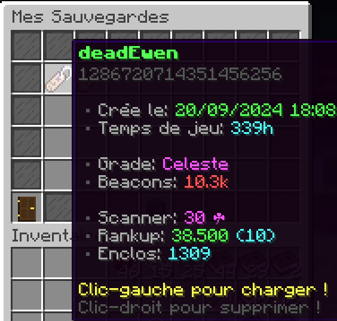
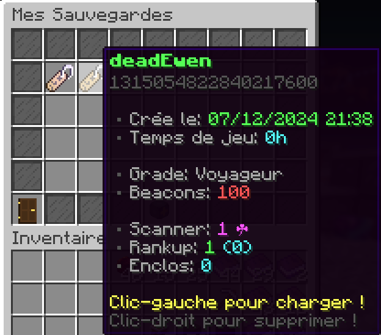

# 📃✍️​ Sauvegardes

 Cette page a pour but de vous présenter le système de sauvegardes. 

## A quoi ça sert ?
Avec le système de sauvegardes (accessible depuis le menu /prison, puis en cliquant sur le name tag à côté de la planette), vous pouvez vous créer plusieurs profils.
Vous pouvez donc ainsi faire plusieurs aventures sur le prison !

## Les sauvegardes
Pour chaque sauvegardes que vous créer, elle auront chacune:
- Un temps de jeux
- Un grade (/rang)
- Beacons
- Scanner
- Niveau d'enclos
- Rankup
- Prestige

Voici un exemple de 2 sauvegardes:

