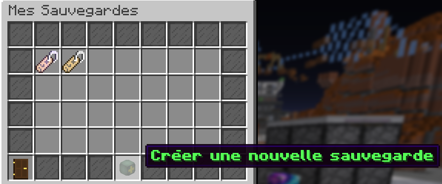

# 📃✍️​ Sauvegardes


Cette page a pour but de vous présenter le système de sauvegardes.


## A quoi ça sert ?

Avec le système de sauvegardes (accessible depuis le menu /prison, puis en cliquant sur le name tag à côté de la planète), vous pouvez vous créer plusieurs profils. Vous pouvez donc ainsi faire plusieurs aventures sur le prison !

## Les sauvegardes

Pour chaque sauvegarde que vous créez, elles auront chacune :

* Un temps de jeux
* Un grade (/rang)
* Beacons
* Scanner
* Niveau d'enclos
* Rankup
* Prestige

### Comment créer une sauvegarde ?

C'est simple ! Vous avez juste à aller dans le menu /prison et de cliquer sur le name tag à côté de la planète. Vous aurez un menu ainsi qu'un bouton pour créer vos sauvegardes :


Vous pouvez créer que 3 sauvegardes au total !


Voici un exemple de 2 sauvegardes:

 
