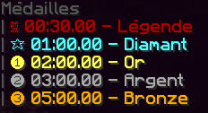
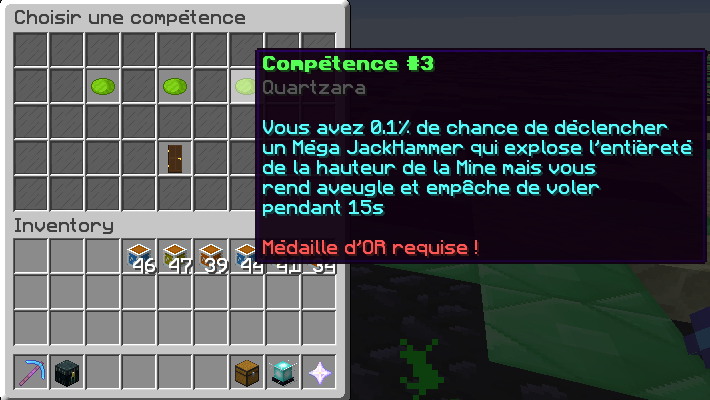

# ⌛ Les Mines Temporelles

Cette page a pour but d'expliquer le principe des mines temporelles


## Introduction
En faisant **/mine travel**, il vous sera possible de vous déplacer dans toutes les mines que vous avez débloquées. À la complétion de celles-ci, vous recevrez une médaille, plus ou moins rare, en fonction du temps que vous avez mis pour miner 90% de la mine (miner jusqu'à 10%)

  

Si vous obtenez la médaille d'or (miner 90% de la mine en moins de 2 minutes) vous débloquerez un choix de compétences dans le **/mine time**. Il faudra choisir 1 des 3 compétences ! Pas d'inquiétudes, si vous faites un mauvais choix, il vous sera toujours possible de changer la compétence choisie en dépensant 10.000 beacons.

  

Évidemment, plus la mine est grande, plus il est difficile de la compléter. Cependant, plus vous allez être avancé dans le jeu, plus vous allez avoir des avantages (enchantements, compétences...) qui vous permettront de compléter les mines plus facilement.

## Compétences
| Mine (chiffre/nom) | Taille | Compétences à prioriser selon nous |
| ------------------  | ------- | ---------------------------------|
| 1 / Tatooth | 21x21 | N/A |
| 2 / Pandoro | 41x41 | Ce dont vous avez besoin en priorité entre RC, tokens ou XP pioche |
| 3 / Zygex | 61x61 | Fracture |
| 4 / Hothe | 81x81 | Bonus de vente |
| 5 / Endon | 101x101 |Trou noir |
| 6 / Scarife | 121x121 | N/A |
| 7 / Kaminoth | 141x141 | Fragments d'artéfact |
| 8 / Aurionis | 161x161 | Multiclonage |
| 9 / Vespera | 181x181 | N/A |
| 10 / Cryptolithe | 201x201 | Geophore |
| 11 / Géodenos | 221x221 | N/A |
| 12 / Ferraxon | 241x241 | Ce dont vous avez besoin en priorité entre RC, tokens ou XP pioche |
| 13 / Crystara | 261x261 | Vente de 50% du sac |
| 14 / Galamin | 281x281 | Vitesse de déplacement et de minage des clones |
| 15 / Telluris | 301x301 | Geophore |
| 16 / Astromine | 321x321 | N/A |
| 17 / Veinatia | 341x341 | Explosion / Excavation |
| 18 / Pyritar | 361x361 | Nuke |
| 19 / Ombrion | 381x381 | N/A |
| 20 / Quartzara | 401x401 | Effet Excavation! |


Ces choix sont purement subjectifs, si vous trouvez une autre compétence plus adaptée à votre style de jeu, prenez là et testez !


