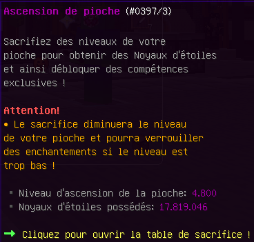
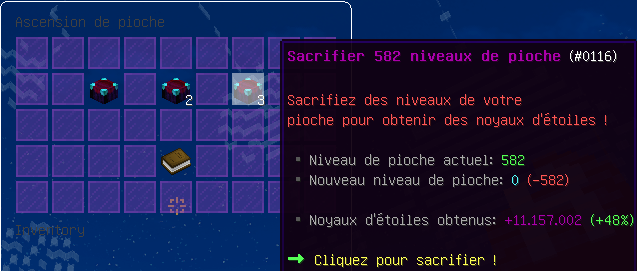

# 🌟 Noyaux d'étoiles


Cette page a pour but de vous expliquer le fonctionnement des noyaux d'étoiles.


## **➺** Comment obtenir des noyaux d'étoiles ?

Pour obtenir des noyaux d'étoiles, vous devez accumuler des niveaux de pioche en minant afin de les sacrifier pour obtenir des noyaux d'étoiles.\
Sacrifier les niveaux de sa pioche ne supprime pas les enchantements, il seront simplement bloqués, jusqu'à atteindre de nouveau le niveau nécessaire pour les utiliser.

## **➺** Comment utiliser les noyaux d'étoiles ?

Vous pouvez les utiliser pour améliorer certains enchantements en bas de la pioche (Voir la page [Enchantements](enchants.md))\
Notez qu'à partir du niveau 100 vous obtenez un bonus additionnel de 1% par tranche de 10 niveaux.

 


#### Nous vous conseillons d'attendre le niveau 150 avant votre premier sacrifice de niveaux afin de débloquer l'enchantement "Astre Céleste".

