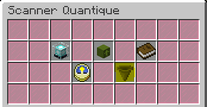

# 🪀 Scanner


Le scanner est un outil utilisable en utilisant la commande /scanner. Il permet d'obtenir des objets rares (armures ou gemmes).


## **➺** Comment l'améliorer ?

L'amélioration du scanner augmente les chances d'obtenir des objets d'une meilleure rareté.\
Pour l'améliorer, vous avez besoin d'un certain nombre de fragments d'étoiles qui s'obtiennent en recyclant les objets octroyés par le scanner. Vous pouvez voir votre avancée de fragments d'étoiles pour le scanner avec le pourcentage inscrit en rose au dessus de votre barre de nourriture.

Une fois l'amélioration lancée, vous devrez attendre avant que l'évolution de votre scanner soit effectuée. La durée de celle-ci sera indiquée à la place de votre pourcentage pour l'améliorer. Vous pouvez aussi diminuer le temps d'amélioration avec des capsules temporelles (Une capsule retire 5 minutes) ou des beacons.


**Attention:** lors de l'utilisation de capsules, si vous en possédez beaucoup, il n'y a pas de confirmation pour utiliser les beacons lorsque vous épuisez votre dernière capsule (faites donc attention à ne pas les dépenser sans le vouloir).


## **➺** Le Recyclage automatique

Le recyclage automatique est simple à utiliser, dans le /scanner, cliquez sur le hopper/entonnoir enchanté qui vous ouvrira un second menu.\

Il suffit ensuite de sélectionner la rareté minimale que vous voulez garder.\

## **➺** Quantité de fragments requis pour augmenter de niveau son scanner.

Retrouvez ci-dessous la quantité de fragments requis pour améliorer votre scanner :

| Passage Niveau | Valeur | Rareté Maximale |
| -------------- | ------ | --------------- |
| Niveau 1       | x      | RARE            |
| Niveau 2       | 10.3K  | ÉPIQUE          |
| Niveau 3       | 21K    | ÉPIQUE          |
| Niveau 4       | 32.5K  | LÉGENDAIRE      |
| Niveau 5       | 45.3K  | LÉGENDAIRE      |
| Niveau 6       | 53.8k  | LÉGENDAIRE      |
| Niveau 7       | 63.5K  | DIVIN           |
| Niveau 8       | 75K    | DIVIN           |
| Niveau 9       | 91.5K  | MYTHIQUE        |
| Niveau 10      | 110K   | MYTHIQUE        |
| Niveau 11      | 129K   | MYTHIQUE        |
| Niveau 12      | 151K   | MYTHIQUE        |
| Niveau 13      | 177.5K | COSMIQUE        |
| Niveau 14      | 210K   | COSMIQUE        |
| Niveau 15      | 248K   | COSMIQUE        |
| Niveau 16      | 382K   | COSMIQUE        |
| Niveau 17      | 593K   | COSMIQUE        |
| Niveau 18      | 921.7K | COSMIQUE        |
| Niveau 19      | 1.45M  | COSMIQUE        |
| Niveau 20      | 2.24M  | PRIMORDIAL      |
| Niveau 21      | 3.54M  | PRIMORDIAL      |
| Niveau 22      | 5.52M  | PRIMORDIAL      |
| Niveau 23      | 8.60M  | PRIMORDIAL      |
| Niveau 24      | 13.33M | TRANSCENDANT    |
| Niveau 25      | 20.80M | TRANSCENDANT    |
| Niveau 26      | 30M    | TRANSCENDANT    |
| Niveau 27      | 50M    | TRANSCENDANT    |
| Niveau 28      | 75M    | TRANSCENDANT    |
| Niveau 29      | 100M   | TRANSCENDANT    |
| Niveau 30      | 130M   | AURORE    |

